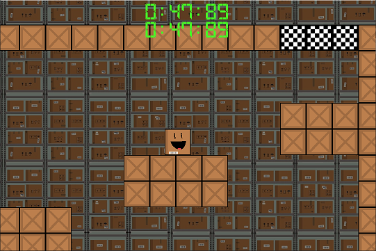
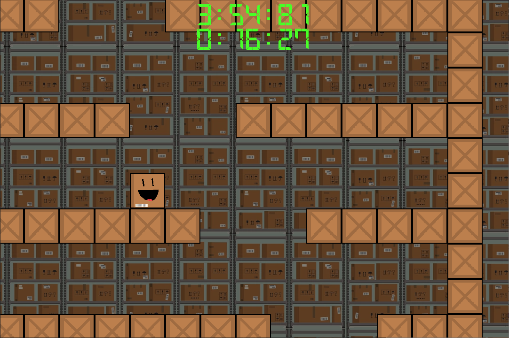

# Warehouse Escape

**A video game about a shipping box escaping its warehouse.**

It's written in C++ with [SDL](https://www.libsdl.org/) (including [SDL_image](https://github.com/libsdl-org/SDL_image), [SDL_mixer](https://github.com/libsdl-org/SDL_mixer), and [SDL_ttf](https://github.com/libsdl-org/SDL_ttf)).

## Platforms
The current release is for Windows only. The zip includes an executable with all of the required .dll files inside. Just keep the executable in the directory and run it.
*If you wanted to try it out on another OS, you'll have to clone the repo and compile it on your own (for now). *

## Controls/Gameplay
|  Button|Action  |
|--|--|
| LMB | Push the box (when hovering over it) |
| r | Restart game to the first level (new run) |

That's it! 

The further from the center of the box you click, the more force you'll apply to it. Once you play it, you'll get a better feel on how to maneuver it and will get better at it every run.

There's two timers at the top of the window that will keep track of two things:

 - The RTA time for completing the entire game (5 levels)
 - The IL time for the *current level only*

These will make it a lot easier for you to see how much better you get at getting the box to where you want it to go.

